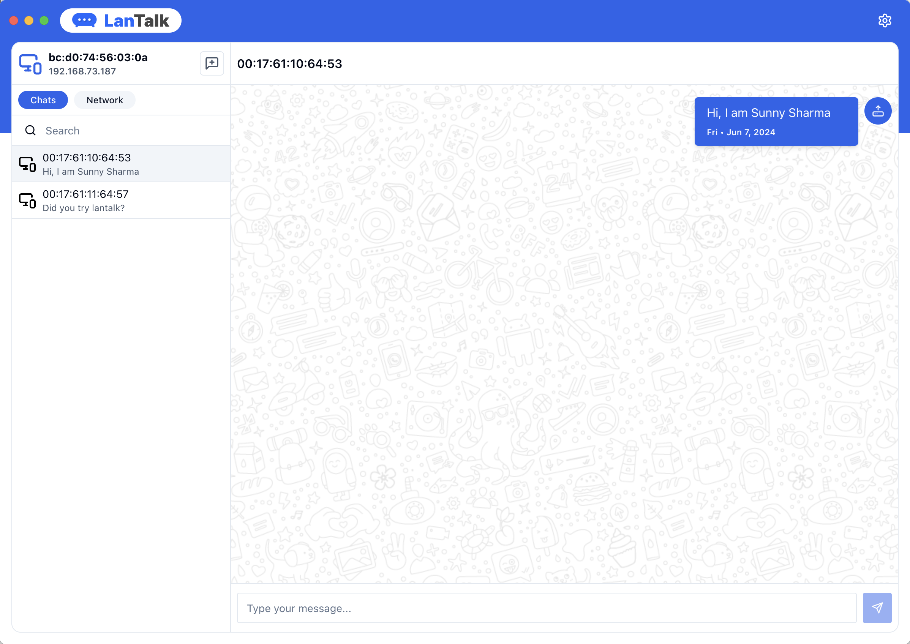

# LanTalk - Chat with peers on local network

With LanTalk, you can chat with anyone who is connected on the same network via WIFI.

## How to run

- npm install
- npm run dev

## How to package

#### For Windows

- npm run build:win

#### For Mac

- npm run build:mac

#### For Linux

- npm run build:linux

NOTE: This assumes `electron-packager` is installed globally

## Author

Sunny Sharma &lt;sunny@vedvyas.io&gt;

Updated on: 19 June 2024

## License

MIT - see [LICENSE](LICENSE)
